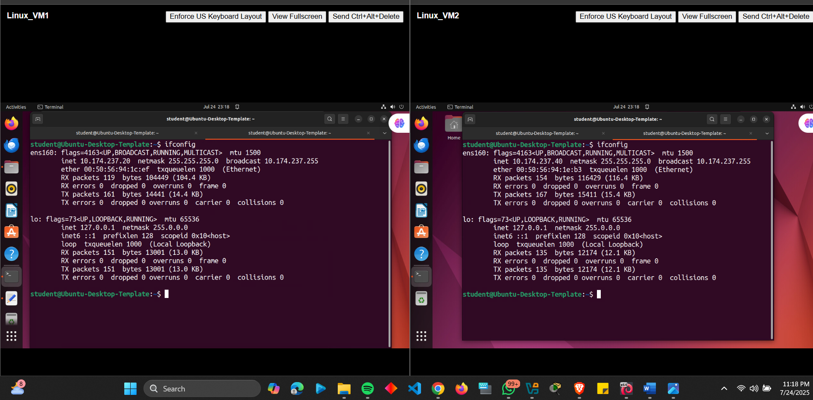
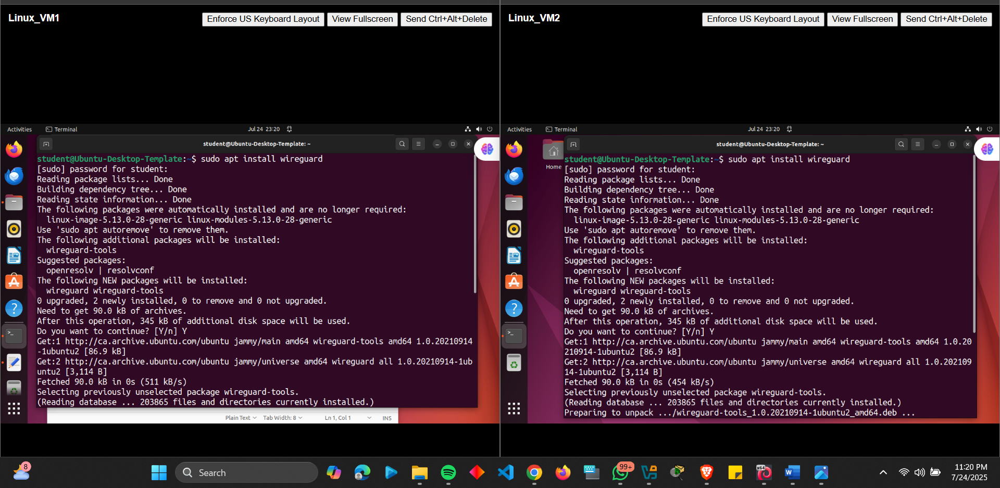
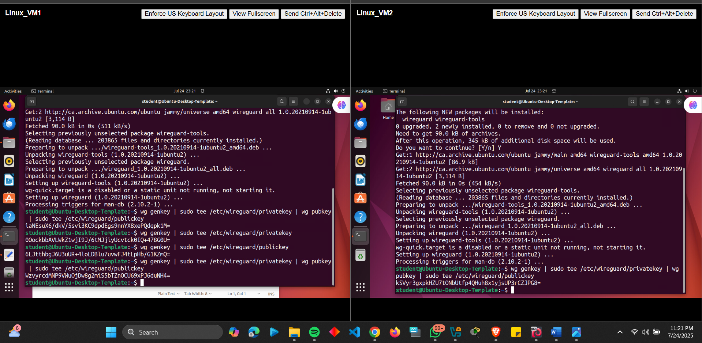
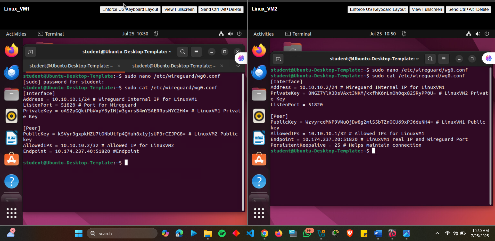
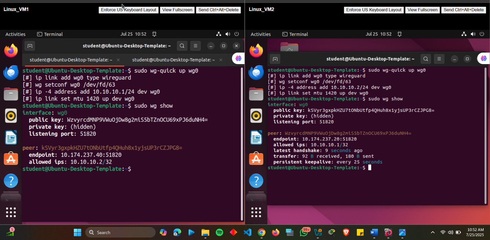
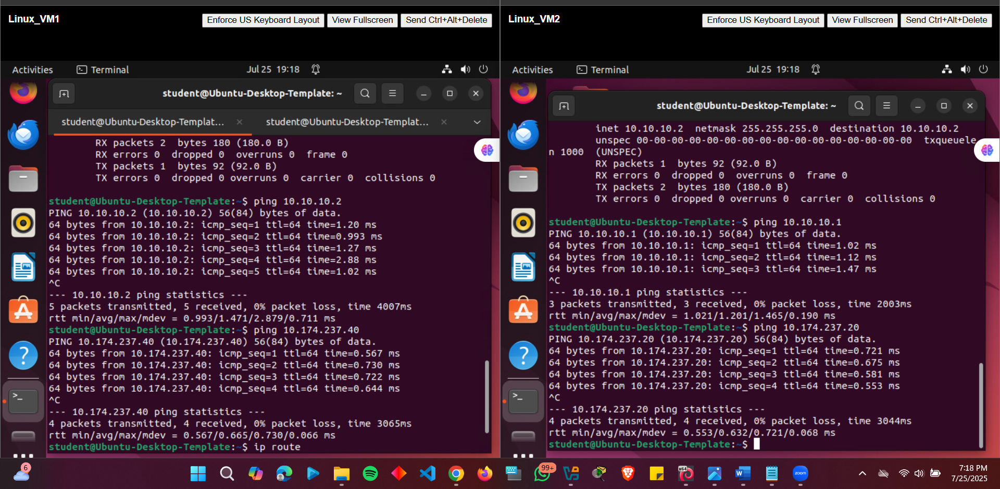
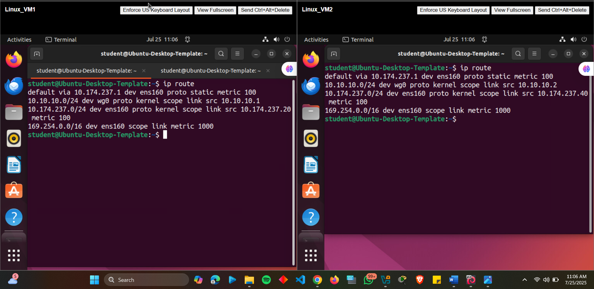

# Project: Secure Virtual Network Link Using WireGuard VPN

## Overview
This project implements a high-performance, secure VPN tunnel between two Linux machines using WireGuard, a modern VPN protocol utilizing state-of-the-art cryptography. The solution creates an encrypted point-to-point connection with minimal overhead while maintaining near-native network performance.

---

## Configuration & Screenshots

### 1. Initial Network Configuration
- Verified baseline network connectivity between LinuxVM1 (10.174.237.20) and LinuxVM2 (10.174.237.40)
- Confirmed Ubuntu 22.04 LTS installation on both systems
- Established prerequisite network connectivity for WireGuard deployment


*Initial network configuration showing IP addresses of both Linux systems*

### 2. WireGuard Installation
- Installed WireGuard package on both systems using apt package manager
- Verified kernel module installation and userspace tools availability
- Confirmed successful installation of wg and wg-quick utilities


*WireGuard package installation process on Ubuntu 22.04 LTS*

### 3. Cryptographic Key Generation
- Generated unique public/private key pairs for each machine
- Implemented proper file permissions (chmod 600) for private key security
- Established foundation for secure peer authentication


*Cryptographic key pair generation using wg genkey command*

### 4. WireGuard Interface Configuration
- Created wg0.conf configuration files with precise network settings
- Configured LinuxVM1 with tunnel IP 10.10.10.1/24
- Configured LinuxVM2 with tunnel IP 10.10.10.2/24
- Implemented PersistentKeepalive for NAT traversal


*WireGuard configuration files showing tunnel IP assignments and peer settings*

### 5. Tunnel Activation and Status Verification
- Activated WireGuard interface using wg-quick up command
- Verified successful peer handshakes and connection establishment
- Monitored tunnel status and encryption statistics


*WireGuard tunnel activation and status verification showing active peers*

### 6. Connectivity Testing and Validation
- Conducted comprehensive ping tests between tunnel endpoints
- Verified bidirectional communication through encrypted tunnel
- Tested both tunnel IP addresses and physical network connectivity


*Comprehensive connectivity testing through WireGuard tunnel*

### 7. Routing Table Verification
- Examined routing table to confirm proper tunnel route installation
- Verified traffic routing through wg0 interface
- Confirmed correct network path selection


*Routing table verification showing WireGuard tunnel routes*

---

## Observations and Challenges

### Initial Implementation Challenges
- **Cryptographic Key Mismatch**: Initial tunnel failure due to public key configuration errors
- **Firewall Port Blocking**: UDP port 51820 blocked by default UFW configuration
- **Routing Conflicts**: Initial CIDR notation errors causing improper traffic routing

### Performance Considerations
- **Minimal CPU Overhead**: WireGuard's efficient cryptographic implementation
- **Low Latency Impact**: Near-native network performance measurements
- **Bandwidth Efficiency**: Minimal protocol overhead compared to traditional VPN solutions

### Security Implementation
- **Perfect Forward Secrecy**: Ephemeral key exchange implementation
- **Cryptographic Best Practices**: Curve25519, ChaCha20, Poly1305, BLAKE2s
- **Minimal Attack Surface**: Compact codebase reducing vulnerability exposure

---

## Lessons Learned

### Technical Implementation Insights
- **Configuration Simplicity**: WireGuard's minimalist configuration approach
- **NAT Traversal Effectiveness**: PersistentKeepalive mechanism reliability
- **Kernel Integration Benefits**: Performance advantages of in-kernel implementation

### Operational Best Practices
- **Key Management**: Secure private key storage and permission management
- **Configuration Validation**: Importance of wg-quick strip for syntax checking
- **Incremental Testing**: Staged deployment and validation methodology

### Security Architecture
- **Cryptographic Modernity**: Advantages of modern cryptographic primitives
- **Minimal Trust Model**: Reduced attack surface through simplicity
- **Performance-Security Balance**: Achieving both high performance and strong security

---

## How to Reproduce

### Prerequisites
- Two Ubuntu 22.04 LTS systems with network connectivity
- Administrative access (sudo privileges) on both machines
- UDP port 51820 open in firewall configurations

### Implementation Steps

1. **Install WireGuard**
```bash
sudo apt update
sudo apt install wireguard resolvconf